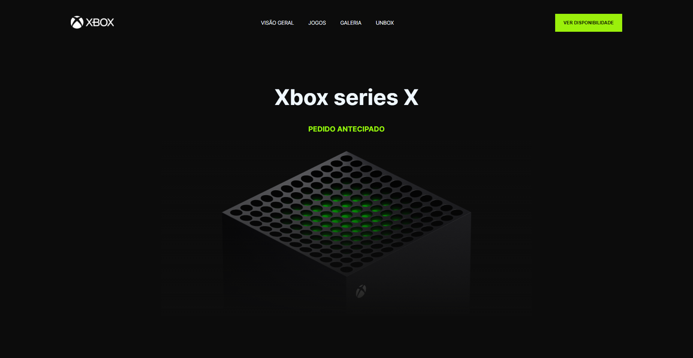
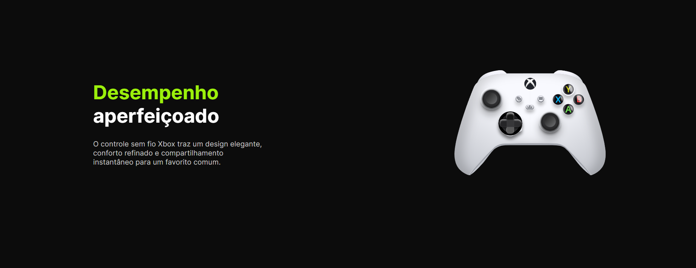
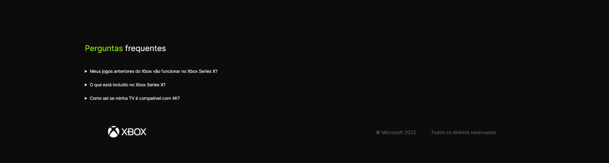

  <h1 align="center">Xbox - Landing Page</h1>

<!-- Getting Started -->
## INICIANDO O PROJETO

Para instalar o projeto em sua maquina siga os passos abaixo.

### INSTALAÇÃO

1. Clone o repositório

   ```sh
   git clone https://github.com/NiloMarcos/Xbox---Landing-Page.git
   ```

2. Entre na pasta

   ```sh
   cd Xbox---Landing-Page
   ```
  
4. Rode o aplicação

   ```sh
    Da maneira que está mais confortavel a rodar as aplicações. 
   ```

### Fotos da aplicação

<section align="center">
  
  
  
  
</section>
